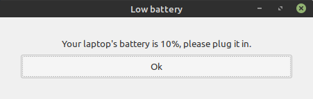

# battery prompt
 A simple prompt when your battery is 10%
 there are probably better alternatives to this but if you'd like to use this feel free to do so.
# preview

#installation
Make sure you have python3 and pip3 installed, you can install pip3  via `sudo apt install python3-pip` and install acpi via `sudo apt install acpi`
then run `pip3 install PyGObject`
after that you can run it via `python3 ~/battery-prompt/battery\ calculate.py`

I reccomend running at the start of your desktop enviorment/ window manager session here i have linked guides to run commands at start on some desktop enviorments and window managers:
**i3:** https://www.reddit.com/r/archlinux/comments/2m4qni/autostart_programs_with_i3_upon_login/ (first comment)
**xfce:** https://superuser.com/questions/27854/starting-a-script-on-xfce-login-and-logout
**kde:** https://www.addictivetips.com/ubuntu-linux-tips/autostart-programs-on-kde-plasma-5/
**gnome:** https://help.ubuntu.com/stable/ubuntu-help/startup-applications.html.en

